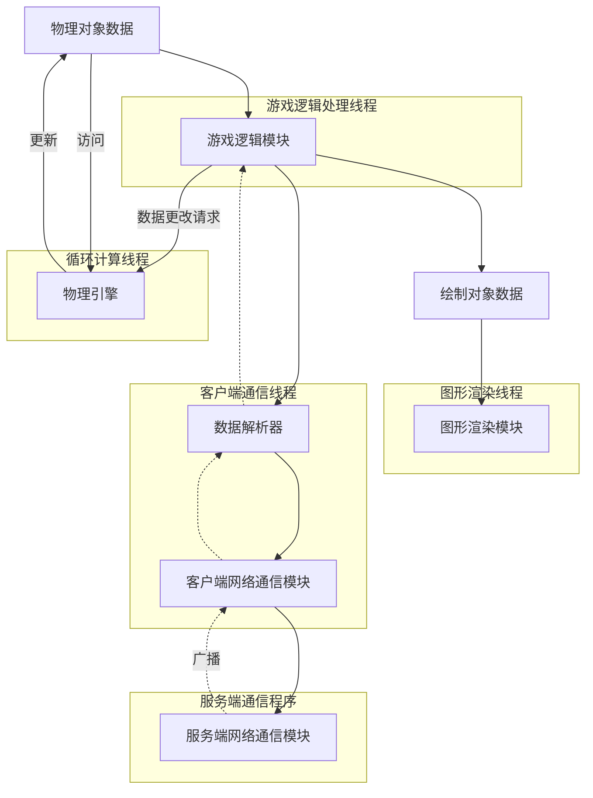
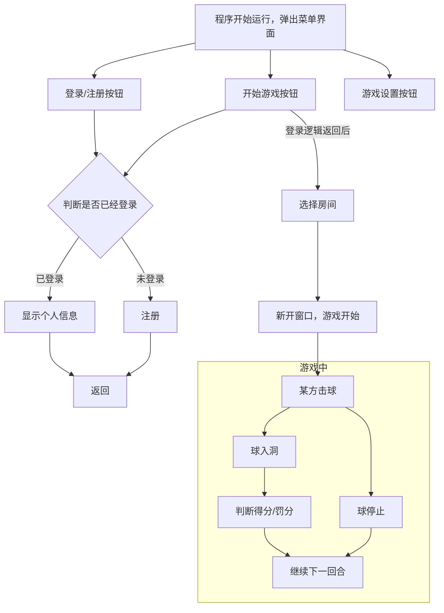

# Tbtennis项目文档

> Simpidbit\<2766277616@qq.com\>
>
> Octobor, 2024.

## 项目架构

其中每个大框都代表一个线程

## 程序逻辑

### 客户端

### 总体逻辑梳理

程序从`main.cpp`里的`main()`函数开始，先进行一系列数据的初始化：

- 

随后，启动 logic 模块线程，此模块负责整个应用程序的业务逻辑，同时负责调度其他模块，并和其他模块进行数据交互.

图形界面库（Qt）和游戏逻辑是相互独立的，图形界面库要和游戏逻辑交互，只能通过全局变量同 logic 模块交互

### logic模块逻辑

### phy_engine模块逻辑

phy_engine 模块 由 logic 模块 支配

### network模块逻辑

## 宏和全局变量文档

## 函数文档

## 类文档

### ball_t

| 属性         | 值                            |
| ------------ | ----------------------------- |
| 所属模块     | phy_engine                    |
| 头文件       | `phy_engine/include/object.h` |
| 成员函数定义 | `phy_engine/object.cpp`       |
| 类型         | 最终派生类                    |
| 派生类       | 无                            |
| 继承自       | `object_t`                    |
| 个性依赖     | 无                            |

表示台球.

`shape_data`为`double`型，表示球的半径.

### byte_t 结构体

| 属性     | 值        |
| -------- | --------- |
| 所属模块 | tbtennis  |
| 头文件   | `macro.h` |
| 个性依赖 | 无        |

提供对内存精确到位的访问.

### line_t

| 属性         | 值                             |
| ------------ | ------------------------------ |
| 所属模块     | phy_engine                     |
| 头文件       | `phy_engine/include/math.h` |
| 成员函数定义 | `phy_engine/math.cpp`       |
| 类型         | 普通类                     |
| 派生类       | 无                             |
| 继承自       | 无                     |
| 个性依赖     | 无                             |

表示直线、射线或线段.

### line_wall_t

| 属性         | 值                             |
| ------------ | ------------------------------ |
| 所属模块     | phy_engine                     |
| 头文件       | `phy_engine/include/object.h` |
| 成员函数定义 | `phy_engine/object.cpp` |
| 类型         | 最终派生类                |
| 派生类       | 无                             |
| 继承自       | `object_t`          |
| 个性依赖     | `line_t`                     |

表示线型墙.

`shape_data`为`std::vector<line_t>`型，表示由哪些线组合成的图形.

### object_t

| 属性         | 值                             |
| ------------ | ------------------------------ |
| 所属模块     | phy_engine                     |
| 头文件       | `phy_engine/include/object.h` |
| 成员函数定义 | `phy_engine/object.cpp` |
| 类型         | 基类，模板类         |
| 派生类       | `ball_t`, `line_wall_t`      |
| 继承自       | 无                     |
| 个性依赖     | `object_shape_e`, `vector_t` |

表示物理引擎需要处理的物理对象.

类模板参数在被派生类继承时指定，表示派生类具体表示的物理对象的形状（用来边界判断）以何种数据类型存储. 用来存储这种数据的成员名为`shape_data`

一般不直接实例化.

### physics_machine_t

| 属性         | 值                             |
| ------------ | ------------------------------ |
| 所属模块     | phy_engine                     |
| 头文件       | `phy_engine/include/physics.h` |
| 成员函数定义 | `phy_engine/physics.cpp` |
| 类型         | 普通类                     |
| 派生类       | 无                             |
| 继承自       | 无                     |
| 个性依赖     | `ball_t`, `line_wall_t`      |

 物理引擎类，由线程调用的lambda函数实例化，并负责物理对象的运动模拟. lambda函数启动时接收一个二级指针，表示储存与逻辑线程共享的物体运动状态数据的内存地址，这个指针指向存储存储物理对象的容器的指针，并在实例化`physics_machine_t`时被传入构造函数.

`physics_machine_t`类还与全局变量`logic_thread_request_msg`以及锁`mtx`有关，物理引擎运行时，逻辑线程可能需要向物理引擎请求增加或者删除元素，此时逻辑线程会将`mtx`上锁，向`logic_thread_request_msg`指向的内存空间的第1位（不是字节！）写入1，第2位写入0（表示添加元素）或1（表示删除元素），第3~6位保留，将要添加/删除的元素数据写入`obj_container_pptr`指向的指针指向的空间，然后将`mtx`解锁. `physics_machine_t`的主循环在每次开始循环时，都会先将`mtx`上锁，随后检查`logic_thread_request_msg`的第1位是否为1，并进行相应的处理，然后将`mtx`解锁，继续下面的计算.

### vector_t

| 属性         | 值                             |
| ------------ | ------------------------------ |
| 所属模块     | phy_engine                     |
| 头文件       | `phy_engine/include/math.h` |
| 成员函数定义 | `phy_engine/math.cpp`       |
| 类型         | 普通类                     |
| 派生类       | 无                             |
| 继承自       | 无                     |
| 个性依赖     | 无                             |

向量类，实现了`+`、`-`、`*`的运算符重载，可直接进行向量之间的运算，`*`分别重载了数乘和向量内积.

## 代码规范

### 开发过程规范

### 命名规范

- **长标识符**：尽量使用较长的、意义明确的标识符，除非在一些标识符意义特别明显的上下文中.
- **慎用大写**：除了全局（静态）常量和后端代码的某些宏定义，其他情况请不要使用大写字母，包括类名，类名请遵从C传统，使用意义更明确的`_t`后缀来命名类.
- **文件/目录命名**：严禁文件/目录名中包含中文，必须以数字、字母、下划线命名，且尽量不使用大写字母.

### 函数定义与使用规范

### 类或对象使用规范

