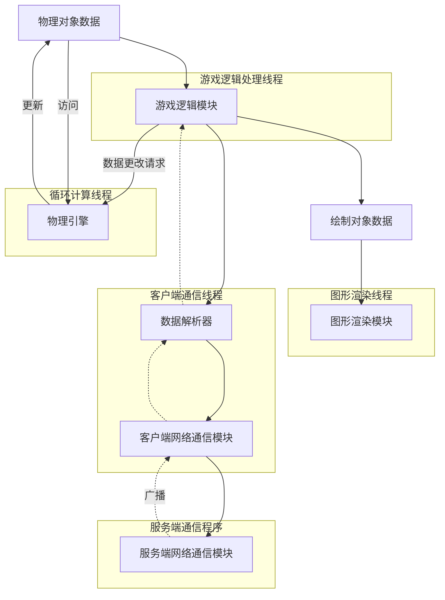
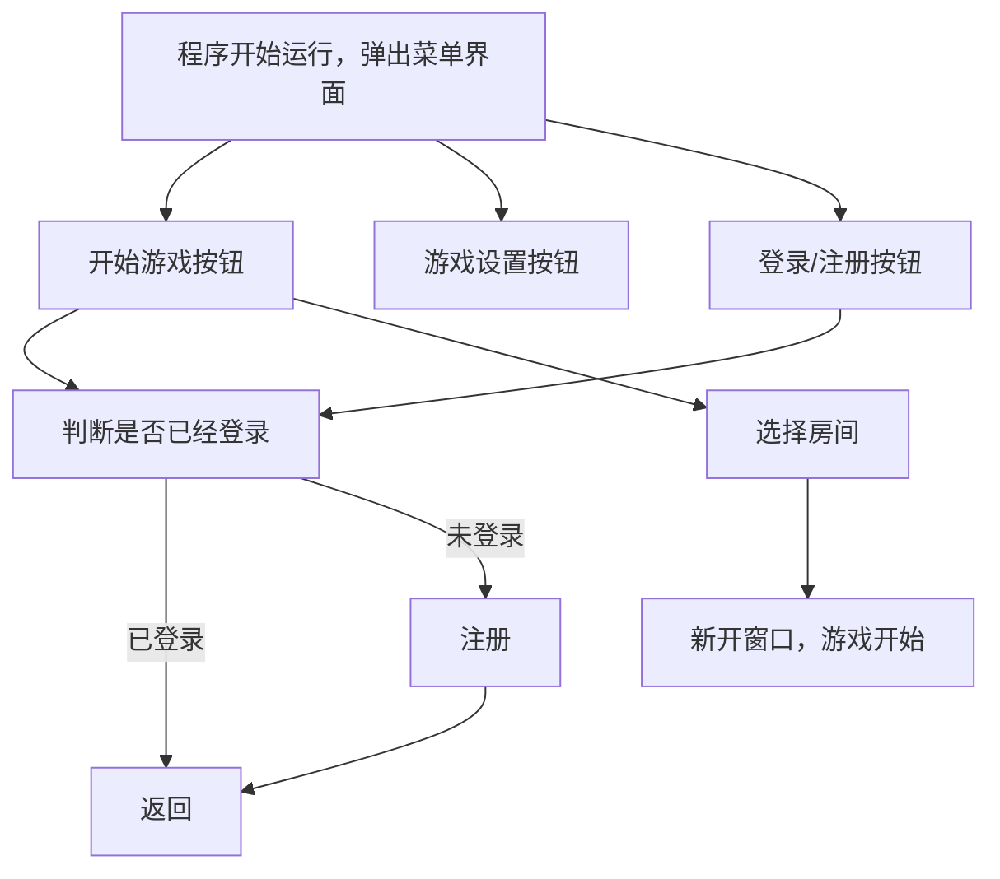

# Tbtennis项目文档

> Simpidbit\<2766277616@qq.com\>
>
> Octobor, 2024.

## 项目架构

其中每个大框都代表一个线程

## 程序逻辑

### 客户端

## 函数文档

## 类文档

## 代码规范

### 注释规范

### 开发过程规范

### 命名规范

- **长标识符**：尽量使用较长的、意义明确的标识符，除非在一些标识符意义特别明显的上下文中.
- **慎用大写**：除了全局（静态）常量和后端代码的某些宏定义，其他情况请不要使用大写字母，包括类名.

### 函数定义与使用规范

### 类或对象使用规范

